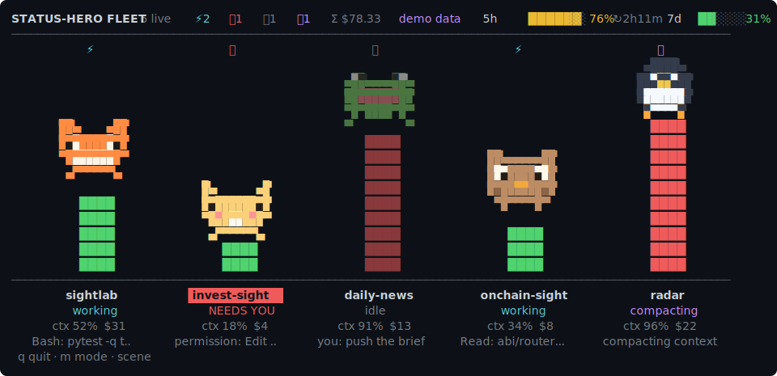
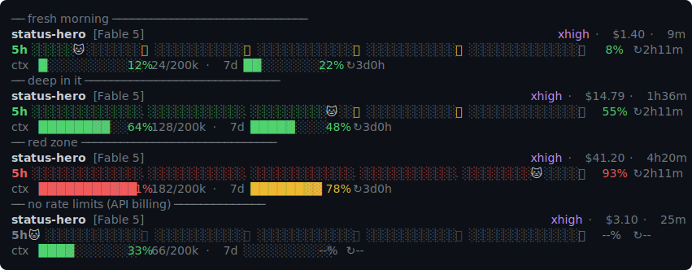
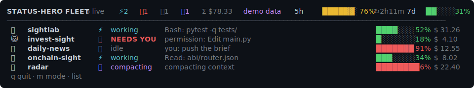
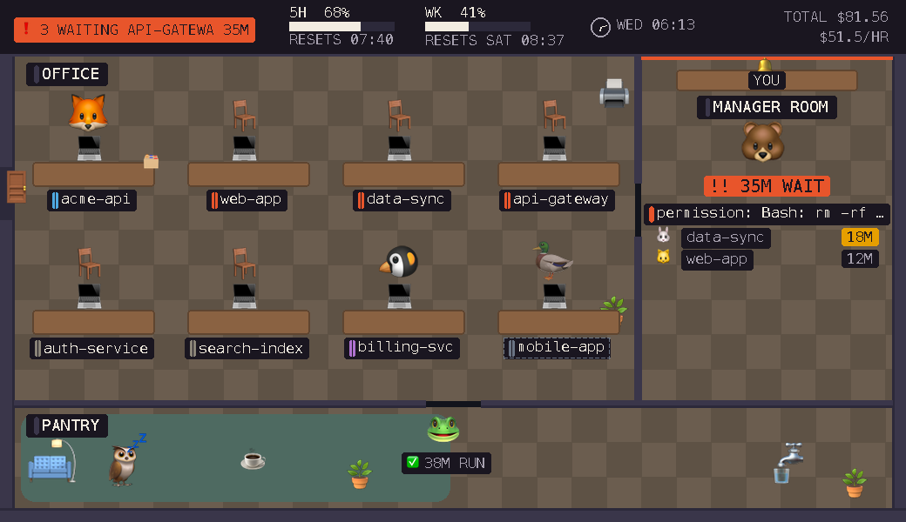
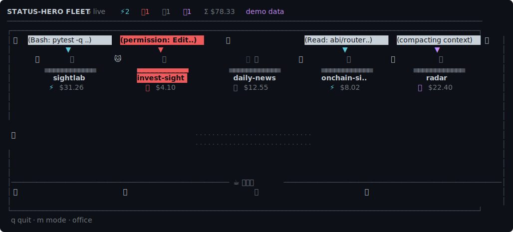

# claude-status-hero

**A statusline that never jitters, and a fleet dashboard that's actually fun.**

Run many Claude Code windows at once? This gives every window a tiny animal
hero, and gives *you* one glanceable board that shows which window is working,
which one **needs you**, and how hard each is leaning on its context window —
plus a statusline that packs 5h/7d budgets, context, git, and cost into three
rock-solid lines.

Two commands, no *required* dependencies — Python ≥3.9 stdlib only. (The
`--pixel` emoji office uses [Pillow](https://python-pillow.org) to bake the
emoji glyphs if it's importable, and falls back to stdlib sprites if it isn't;
everything else is pure stdlib.)

| | what | where it runs |
|---|---|---|
| `hero_line.py` | the **gauge** — a fixed 3-line statusline | inside every Claude Code window |
| `hero_board.py` | the **game** — an animated fleet dashboard | its own terminal pane |





## Why two pieces?

v1 of this project tried to render a whole game *inside* the statusline.
Physics said no ([docs/DESIGN.md](docs/DESIGN.md) has the autopsy):

- Claude Code refreshes the statusline on **events, debounced 300 ms** — and
  not at all while idle. Smooth animation in a statusline is impossible.
- If your statusline's **line count varies**, the prompt box jumps up and down.
- Emoji and even common block glyphs have **terminal-dependent widths**;
  naïve centering math drifts columns.

So v2 splits it: the statusline is a *gauge* — exactly 3 lines, every line
padded to an exact display width, alignment computed with ANSI-aware
East-Asian-Width rules, missing data rendered as dim placeholders instead of
dropped rows. The *game* — pixel-art heroes, pillars, blinking beacons, real
frame rate — lives in `hero_board.py`, a proper alt-screen TUI where 4+ fps is
trivial.

## The gauge (statusline)

```
sightlab [Fable 5] ⎇ main·2              xhigh · $14.79 · 1h36m
5h ░░░░░░░░░░.░░░░░░░🦊░⭐░░░░░⭐░░░░░░🏁  55% ↻2h11m
ctx ████████░░░░ 64% 128/200k · 7d █████░░░░░ 48% ↻3d0h · ⚡2 ❗1
```

- **Line 1** — project, model, git branch (+dirty count), effort, session
  cost, elapsed time.
- **Line 2** — your hero walks the **5-hour rate-limit track**. ⭐ coins mark
  each 20% of budget (collected as you pass), 🏁 is the limit. Colors go
  green → yellow → red.
- **Line 3** — **context** meter (the thing that triggers compaction),
  **7-day** meter, and a **fleet summary**: ⚡ how many other windows are
  working, ❗ how many need you — visible from *any* window.
- No Pro/Max rate data (API billing)? The track dims and shows `--%`.
  Rows are never dropped; the box never moves.

### Want the fleet *inside* the statusline?

```bash
python3 hero_line.py --style list     # 7 lines: gauge + one row per session
python3 hero_line.py --style fleet    # 10 lines: the board's pixel scene, static
python3 hero_line.py --style gauge    # back to the 3-line default
```

`list` is the sweet spot for many windows: the 3 gauge lines plus up to four
compact fleet rows (emoji hero, state, live activity, ctx bar, cost — your
own window highlighted, always visible, `+N` overflow, blank rows pad so the
height never changes). `fleet` renders the full pixel-art scene instead.
Honest trade-offs (physics, not laziness): extra rows in every window, and
**no animation** — the statusline only re-renders when Claude Code asks
(list/fleet set `refreshInterval: 2` so other windows' states stay fresh;
beacons are steady, not blinking). The animated version is and stays
`hero_board.py` in its own pane.

## The board (fleet dashboard)

Open a spare pane, run `python3 hero_board.py`, keep it in the corner:

- one **pixel-art hero per live session** — big enough to actually see
- each stands on a **pillar = its context %** (red pillar ≈ compaction soon)
- state beacons: ⚡ working (hero trots) · ❗ **NEEDS YOU** (blinks, name
  inverted, macOS notification / Windows beep) · 💤 idle · 🌀 compacting ·
  👻 stale
- last activity per session: `you: fix the tests…`, `Bash: pytest -q…` —
  so you know *which* window to jump to and *why*
- header: account-wide 5h/7d meters, Σ cost, live count
- `m` cycles scene → list → office; `q` quits; `--fps 8` for smoother motion



### The pixel office (`--pixel`) — the main view

The flagship. A full 1040×600 pixel-art office rendered to a real bitmap and
blitted into the terminal with a hand-rolled sixel encoder — the same zones as
the TUI (office desks, a manager-room queue, a pantry) but *drawn*, not typed.
Each session is its **animal-emoji hero** baked to pixels (Apple Color Emoji
via Pillow when it's importable; a stdlib sprite otherwise). It's
**event-driven, not animated**: sessions teleport between rooms as their state
changes, and a new frame is drawn only when a session file changes or the clock
ticks a minute.



```bash
python3 hero_board.py --pixel            # emoji office, live fleet
python3 hero_board.py --demo --pixel     # emoji office, fake fleet
python3 hero_board.py --pixel --scale 2  # 2× nearest-neighbour for Retina panes
```

- **Manager room, not a reception desk**: sessions that flip to `NEEDS YOU`
  teleport here, sorted **longest-wait-first**, front-and-biggest with what
  they need (`permission: Bash rm -rf …`, `waiting for you`). A desk marked
  with **your name** — pulled from your OS account, falling back to `YOU` —
  sits behind the counter; that's who the queue is waiting on.
- **Long-wait escalation**: a queued wait chip climbs dim → amber (≥15 min) →
  vermillion + `!!` (≥30 min), so a neglected window can't hide behind the
  front of the queue.
- **HUD**: an alarm banner (`N WAITING <name> <mins>` / `ALL CLEAR`), 5h/weekly
  burn gauges with time-to-reset, a live clock, and running cost + $/hr.
- **Fallback chain**: it probes for sixel support (`STATUS_HERO_SIXEL=1`/`0`
  forces it); on a terminal that can't show sixel it drops **automatically** to
  the `--office` TUI below. Every frame is also written to
  `~/.claude/status-hero/pixel-office.png` (`--png PATH` to change it) — handy
  for previewing without a sixel terminal, or for anyone reviewing a change who
  can't see the image inline.

### The office (`--office`) — the TUI fallback

The half-block floor plan `--pixel` drops to when the terminal can't show sixel
graphics — same rooms, typed instead of drawn. A floor plan, not a lineup. Each
session's actor is a single **emoji — the
exact same hero glyph its statusline already shows** (🦊🐱🐸🦉🐧🐰🐻🦆), so
a glance links a PowerShell/iTerm/tmux window to its desk on the board. Every
live session gets a compact **desk pod**: an empty chair + laptop, a name
plate, and a status line of *state beacon + cost so far* — no context % or
usage meters on the floor plan, the statusline already has those. A **speech
bubble** pops up over a working/compacting/needs-you actor carrying its
current activity (`Bash: pytest -q…`, `you: fix the tests…`).

Each session owns a **column**: its desk at the top, its break-room
(**茶水间**) spot at the bottom. Going **idle** walks the hero down its column
to the break room, and back up when it resumes. **Open a new Claude Code
window** and its hero walks in through the door in the left wall; **close it**
and the hero walks back out. A session flipping to **NEEDS YOU** snaps
straight to its desk and blinks — attention beats choreography. The room is
dressed with a rug, a wall clock, potted plants, a water cooler, and a
desk-front bar that turns red under `NEEDS YOU` — no other desk colouring.



Office needs ≥ 15 interior rows and ~12 columns per session (room height caps
at 18 rows even on a huge terminal — dense, not stretched); when it can't fit
(narrow pane, > 8 sessions) it falls back to the dense list. Try it: `python3
hero_board.py --demo --office` — a visitor walks in and back out every ~22 s.

### Auto-launch (`--autostart`, macOS + Windows)

Don't want to remember to open the board? Turn on auto-launch and a single
board window opens itself whenever you start Claude Code:

```bash
python3 hero_board.py --autostart on            # install
python3 hero_board.py --autostart on --office    # or pick another mode
python3 hero_board.py --autostart off           # remove
python3 hero_board.py --autostart status
```

It adds one `SessionStart` hook that runs `hero_board.py --ensure <mode>`
(default **`--pixel`** on macOS — the emoji office, TUI fallback — and
**`--office`** on Windows, since the sixel pixel office needs a macOS-class
terminal; pass `--office`, `--list`, or `--scene` to change it), which opens
a new terminal window (iTerm2/Terminal on macOS, Windows Terminal on Windows,
with a `cmd start` console fallback) — but **only if a board isn't already
running** (singleton, so extra Claude Code windows never stack more boards).
It backs up `settings.json` and leaves every other hook untouched;
`hero_line.py`'s own hooks are not affected.

## Install

Requires Python ≥3.9 (macOS system Python is fine) and any modern terminal
(iTerm2, Windows Terminal, WezTerm, Kitty…). No pip packages.

```bash
git clone https://github.com/hhchuan89/claude-status-hero
cd claude-status-hero
python3 hero_line.py --install     # statusline + hooks → ~/.claude/settings.json
python3 hero_board.py --demo       # try the board right now, with fake data
```

`--install` backs up your `settings.json` first and prints the rollback
command; `--uninstall` removes exactly our entries and nothing else. The hooks
(9 events, 5 s timeout, always exit 0) are what feed per-session state to the
board — without them you still get metrics, just not working/needs-you.

**Run `--install` on each machine.** It bakes the machine's absolute Python
and script paths into `settings.json` — a settings file synced from macOS to
Windows (or vice versa) makes every hook fail silently and the board shows
`no live sessions` forever.

Try before installing:

```bash
python3 hero_line.py --demo        # three sample statusline states
python3 hero_line.py --simulate    # animated fake session (GIF material)
python3 hero_line.py --doctor      # alignment + color diagnostics
```

## If something misaligns

Run `--doctor` — if its test rows don't line up, your terminal disagrees
about some glyph's width:

- `STATUS_HERO_ASCII=1` — pure ASCII everywhere (old PowerShell, plain TTYs)
- `STATUS_HERO_AMBIG_WIDE=1` — for CJK terminals that render
  ambiguous-width glyphs as double width (implies ASCII bars)
- `NO_COLOR=1` — monochrome

The glyph palette is deliberately conservative: bars use `█ ░`, emoji only
from the always-two-columns set (dedicated pictographs like 🦊 ⭐ 🏁 ⚡ ❗),
never width-trap symbols like ⚠ ⏱ ✔ that depend on variation selectors.

## How state flows

```
Claude Code ──stdin JSON──► hero_line.py ──┐ metrics, every render
Claude Code ──9 hooks────► hero_line.py ──┤ state transitions
                                           ▼
                     ~/.claude/status-hero/sessions/<session_id>.json
                                           ▲
hero_board.py ──reads all, 4 fps──────────┘
```

States: `SessionStart/UserPromptSubmit/PostToolUse → working`,
`Notification(permission|idle) → needs_you`, `Stop → idle`,
`Pre/PostCompact → compacting`, `SessionEnd → tombstone` (not a delete: an
in-flight statusline render can land seconds later and must not resurrect
the session; the board hides tombstones at once and buries them after a
minute). A session whose
heartbeat is stale decays to idle, then ghost 👻, then is buried after 24 h.
Everything is local files — no network, ever. (Prompt snippets are stored in
that local state dir; they never leave your machine.)

## Tests

```bash
python3 tests/test_render.py   # 1200+ checks: geometry, hooks, installer, board
python3 tests/test_pixel.py    # pixel office: sixel/PNG encoders, data mapping, fallback
```

The suite hammers the invariants: always 3 lines, exact display width for
every payload × terminal width × glyph mode, ANSI-injection sanitization,
installer idempotence, foreign-hook preservation.

## Prior art / thanks

[ccstatusline](https://github.com/sirmalloc/ccstatusline) ·
[claude-powerline](https://github.com/Owloops/claude-powerline) ·
[ccusage](https://github.com/ryoppippi/ccusage) ·
[claude-squad](https://github.com/smtg-ai/claude-squad) ·
[chafa](https://hpjansson.org/chafa/) — and Anthropic's own Agent View.
The niche this fills: the fun layer and the fleet layer, merged.

## License

MIT — see [LICENSE](LICENSE).
